# HW06 – Interactive WebGL Bowling Game

**Course:** Computer Graphics – Spring 2026
**Assignment:** Exercise 6

---

## Group Members

- **Ron Reshef**
- **Dor Englender**

---

## How to Run

The project uses ES modules (`import`/`export`) for Three.js and OrbitControls, which require a proper HTTP server — opening `index.html` directly as a `file://` URL will fail with CORS errors.

**Option 1 – VS Code Live Server (recommended)**
1. Install the [Live Server extension](https://marketplace.visualstudio.com/items?itemName=ritwickdey.LiveServer).
2. Right-click `index.html` → **Open with Live Server**.

**Option 2 – Python built-in server**
```bash
# Python 3
python -m http.server 8080
# then open http://localhost:8080
```

**Option 3 – Node / npx**
```bash
npx serve .
# then open the URL printed in the terminal
```

---

## Control Scheme

| Key | Phase | Action |
|---|---|---|
| `← / →` Arrows | Positioning only | Slide the ball horizontally across the approach area up to the gutter edge |
| `Spacebar` | Positioning → Aiming → Power | Advances through the 4-step launch cycle one stage at a time |
| `M` | Any | Toggle background music and sound effects mute / unmute |
| `O` | Any | Toggle OrbitControls on / off for free camera exploration |
| `C` | Any | Snap the camera to a frontal view centered on the neon sign |
| `R` | Any | Hard-reset the entire game — wipes the scorecard, restores all 10 pins, returns ball to approach |

---

## Implementation Features & Enhancements

### Graphics & Scene Architecture (carried from HW05)

- **10-Pin Lathe Geometry:** All 10 pins are built from a single `THREE.LatheGeometry` profile swept 360° around the Y-axis, producing a smooth, anatomically accurate shape — wide belly at Y=0.35, narrow neck at Y=0.85, and a rounded head cap at Y=1.25. A classic red stripe cylinder (radius 0.107) floats just above the neck geometry to avoid Z-fighting. A single template group is constructed once and cloned to all 10 positions for DRY, GPU-friendly instancing.

- **Cobalt Bowling Ball with Finger Holes:** The ball (radius 0.35) is rendered with a high-shininess `MeshPhongMaterial`. Three dark finger-hole cylinders are embedded slightly below the surface and angled inward so their rims sit flush against the sphere without visible intersection seams.

- **Procedural Wood Textures:** A custom canvas-based texture engine generates all three lane surfaces at runtime using a seeded Mulberry32 PRNG — no external image downloads required. Each zone has its own distinct visual character:
  - **Lane** (`seed=101`): Light maple with a polished gloss finish.
  - **Approach** (`seed=202`): Matching maple with an edge-darkening lateral gradient that fades toward the gutters.
  - **Pin Deck** (`seed=303`): Warmer maple to visually frame the pin formation.
  All textures are 512×2048 px and rendered with maximum anisotropic filtering.

- **High-DPI Neon Sign:** A `HangingSign` component renders the "Ron × Dor Bowling" lettering onto an oversized canvas (4096 px wide) using layered `shadowBlur` passes in blue and white, producing a convincing self-emissive neon glow. The sign is suspended from a dark-metal I-beam on two vertical pillars and lit by a dedicated point light source positioned directly above it.

- **Lane Markings:** The red foul line, five amber targeting arrows (at Z=−15), and two rows of approach dots (at Z=7 and Z=12) are all raised by a small Y-offset above their parent surfaces to eliminate Z-fighting entirely.

---

### 4-Step Arcade Launch System

The ball launch is structured as a deterministic state machine that locks one degree of freedom per `Spacebar` press, giving the player complete intentional control over every roll:

```
positioning  →  aiming  →  power  →  rolling  →  resolving
```

1. **Positioning:** The ball rests on the approach. `← / →` arrows slide it horizontally up to ±1.76 units from centre — wide enough to deliberately aim into a gutter.
2. **Aiming:** A `THREE.ArrowHelper` is attached to the ball and sweeps in a ±40° pendulum arc at 1.5 rad/s. The player hits `Spacebar` to freeze the angle at the moment they want. The arrow is immediately removed before the next phase.
3. **Power:** A vertical oscillating power meter appears on the right edge of the screen. The fill value bounces between 0% and 100% at 2.0 cycles/s. `Spacebar` locks the value and releases the ball.
4. **Rolling:** Velocity is decomposed trigonometrically — `vx = power × speed × sin(angle)`, `vz = −power × speed × cos(angle)` — and applied each frame via Euler integration. The game transitions to `resolving` automatically when the ball stops or passes Z=−60.

---

### Real-Time Physics & Rolling Friction

- **Euler Integration:** Ball position advances each frame via `position.addScaledVector(velocity, deltaTime)` using the delta time from `THREE.Clock` for frame-rate-independent motion.
- **Angular Rolling Rotation:** The ball visually spins around its X-axis at a rate proportional to forward speed — `rotation.x -= (|vz| / radius) × dt` — so the rolling always matches the surface contact point exactly.
- **Friction Deceleration:** A constant `0.4 units/s²` deceleration is applied to `vz` while the ball is in forward motion, so lightly thrown balls slow down naturally before reaching the pins rather than stopping abruptly.
- **Impact Deflection:** When the ball contacts a pin, `vz` is reduced by 25% and a lateral deflection force proportional to the X offset from the pin centre is applied to `vx`, producing convincing diagonal rebound trajectories.
- **Pin Toppling Animation:** Each hit pin rotates around an axis perpendicular to its fall direction using a randomized speed factor (3.5–6.0 rad/s) and a small angular jitter on the topple direction. As rotation accumulates, the pin's Y position gradually sinks so the base settles cleanly against the deck. At π/2 radians, the pin is considered fully fallen and removed from the formation group.
- **Pin-to-Pin Chain Propagation:** Every pin that begins toppling immediately checks all standing neighbors within 0.85 units and starts their topple animation with independent random characteristics, producing cascading chain reactions across the formation.

---

### Sloped Gutter Geometric Separation

Gutter ball tracking required careful geometry coordination between the lane layout, ball radius, and collision logic:

- **Expanded Gutter Width:** The gutter channels in `BowlingLane.js` were widened from 0.5 to **0.7 units**, shifting their centres to X=±2.10 (computed as `±(1.75 + GUTTER_WIDTH / 2)`). This ensures the ball's inner edge (at 2.10 − 0.35 = 1.75) sits exactly flush against the lane border with zero overlap.
- **Centre-Locked Ball Tracking:** Once the ball crosses the foul line (Z ≤ 0) and its X position exceeds ±1.75, it is snapped to X=±2.10 and Y=0.45, locked to the gutter centre for the remainder of the roll.
- **Absolute Collision Guard:** The `isGutterBall` flag is set at the moment of gutter entry and causes `checkCollisions()` to return immediately on every subsequent frame, preventing corner pins 7 and 10 (at X=±1.5) from being credited as knocked down by a ball that never reached them.
- **Slight Forward Tilt:** The gutter geometry carries a `rotation.x = −0.0035` tilt so the far (pin-deck) end sits visually lower, reinforcing the impression of the ball rolling into a recessed channel.

---

### Official 10-Frame Scoring Engine

The scoring backend implements the complete official ruleset using a flat-ball-index walk:

- **Flat Array Bonus Lookup:** All recorded rolls across all frames are concatenated into a single `allBalls` array. A `ballIdx` cursor advances by 1 for strikes and 2 for open/spare frames, allowing any frame's bonus balls to be read directly from `allBalls[ballIdx + 1]` and `allBalls[ballIdx + 2]` without special-case branching.
- **Cumulative Totals:** Each frame's running total is set to `null` until all bonus balls it depends on have been thrown. This prevents premature totals from appearing mid-game.
- **Frame 10 Special Rules:** The 10th frame is handled independently. It always records up to 3 balls. A roll 1 strike resets the pins before roll 2. A roll 2 strike (or spare) resets pins before roll 3. The Turkey case (three strikes) is fully supported. The frame is considered complete only when 3 balls have been thrown, or when 2 balls have been thrown without earning a bonus ball.
- **Live DOM Scorecard:** The `ScorecardUI` component injects a 10-frame grid directly into the page as a CSS overlay. Each frame's shot boxes update immediately after every roll with the correct notation — `X` for strikes, `/` for spares, `-` for zero — and the cumulative total row fills in as bonus balls are resolved. When the game ends, the scorecard title replaces itself with a "GAME OVER – Press R to Restart" banner.

---

### Immersive Ambient Audio & Sound Effects *(Bonus Feature)*

- **Background Music Loop:** A ~2 minute ambient track (`sounds/bg.mp3`) is loaded at startup with `bgMusic.loop = true` and a comfortable volume of 0.35. To satisfy browser autoplay policies, playback does not begin until the player's first keydown interaction — at which point a self-removing event listener fires `bgMusic.play()` and detaches itself from the document.
- **Pin Impact Sound Effect:** A short physical crash clip (`sounds/strike.mp3`) is loaded at volume 0.85. It fires at the very first frame a ball-to-pin collision is detected by resetting `strikeSound.currentTime = 0` before calling `.play()`, ensuring zero latency even when multiple pins are contacted in the same frame.
- **M Key Mute Toggle:** Pressing `M` flips the `isMuted` flag, sets `bgMusic.muted` accordingly, and updates the `#mute-label` text in the controls card between "Mute Music" and "Unmute Music" — all wired through the existing unified `keydown` handler with no separate button element.

---

## Submission Media

### Main Gameplay Animation

<div align="center">
  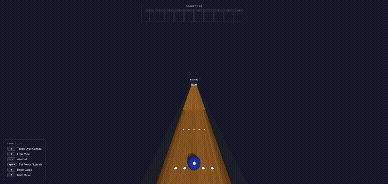
  <p><i>Full gameplay loop demonstrating the 4-step launch cycle — ball positioning, pendulum aiming, power meter lock, rolling contact, pin toppling chain reaction, and a gutter ball sinking smoothly past pins 7 and 10.</i></p>
</div>

---

### Static Architecture Captures (HW05 Base)

#### 1. Overall Lane View
<div align="center">
  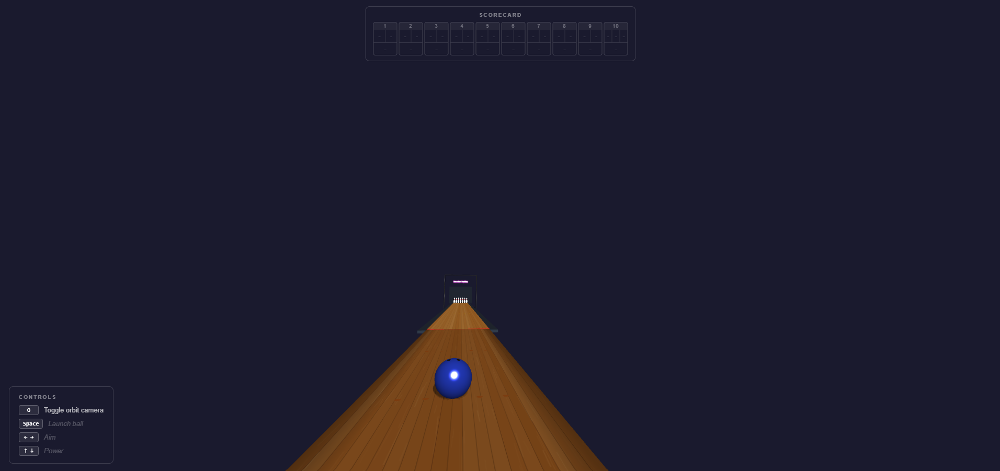
  <p><i>Overall view of the bowling lane showcasing the complete layout with pins, distinct wood textures, and the custom hanging neon sign.</i></p>
</div>

#### 2. Close-up View of Pin Formation
<div align="center">
  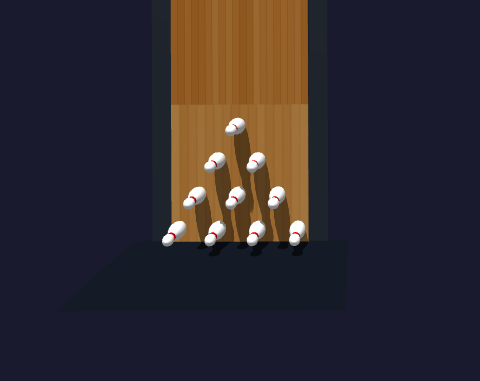
  <p><i>Close-up view showcasing the regulatory 10-pin triangular layout, detailed lathe geometry profiles, and independent shadow mapping.</i></p>
</div>

#### 3. Bowling Ball on Approach Area
<div align="center">
  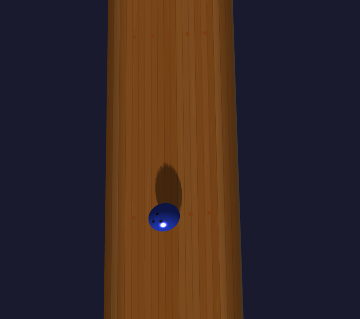
  <p><i>View showcasing the procedural bowling ball and embedded finger holes, sitting perfectly flush on the high-contrast dark walnut approach surface.</i></p>
</div>

#### 4. Camera Controls Demonstration
<div align="center">
  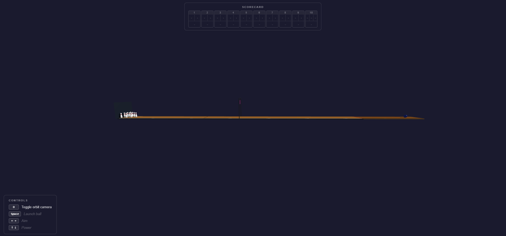
  <p><i>An alternative angled perspective view demonstrating full OrbitControls functionality, responsive aspect ratio rendering, and dynamic shadow frustum execution.</i></p>
</div>

#### 5. Isometric Alley Profile
<div align="center">
  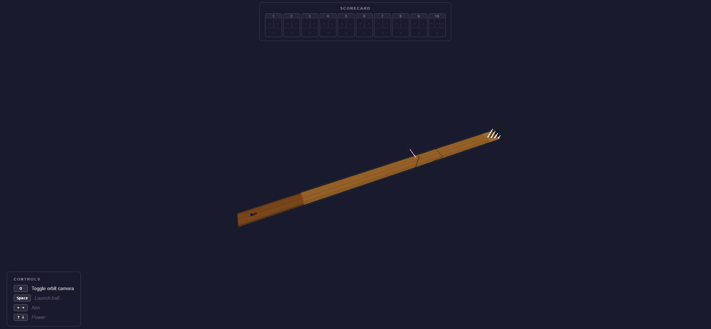
  <p><i>An alternative long-distance side profile highlighting the structural depth of the lane body and the drop-off into the recessed gutters.</i></p>
</div>

#### 6. Top-Down Orthogonal View
<div align="center">
  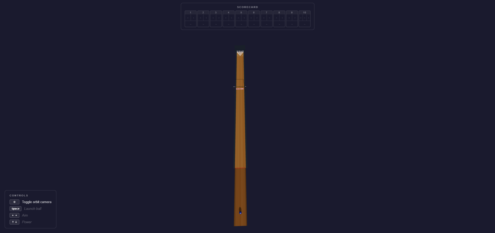
  <p><i>A strict top-down layout view verifying the perfect geometric alignment of the lane arrows, the high-contrast approach dots, and the absolute symmetry of the pin deck.</i></p>
</div>

#### 7. Custom Branding Signage Detail
<div align="center">
  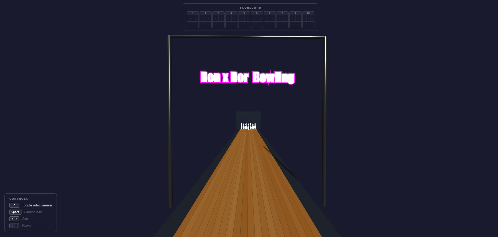
  <p><i>Close-up inspection of the custom high-DPI canvas-generated 'Ron × Dor Bowling' sign, emphasizing the low-blur, sharp vector text, and localized self-emissive lighting filters.</i></p>
</div>

---

### Interactive Phase Captures (HW06 New)

#### 8. Aiming Phase – Pendulum Arrow Guide
<div align="center">
  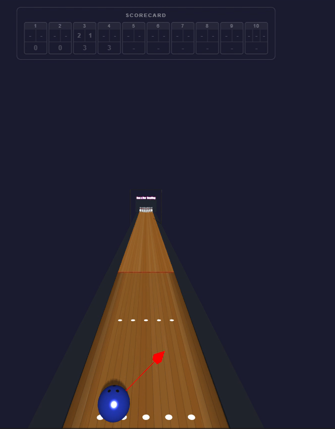
  <p><i>The aiming phase with the red THREE.ArrowHelper sweeping in a ±40° pendulum arc above the ball. The player freezes the angle with Spacebar at the desired launch direction.</i></p>
</div>

#### 9. Power Phase – Vertical Meter UI
<div align="center">
  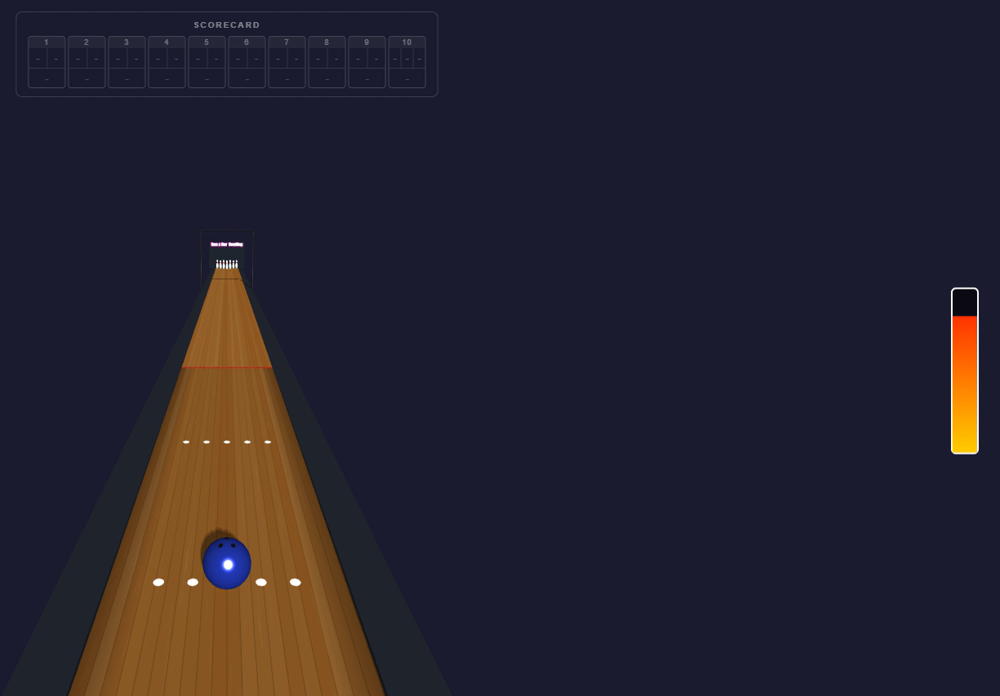
  <p><i>The power phase with the right-side vertical meter filling and emptying in a continuous oscillation. The gradient bar transitions from yellow at low power to red at maximum.</i></p>
</div>

#### 10. Game Over – Resolved Frame 10 Layout
<div align="center">
  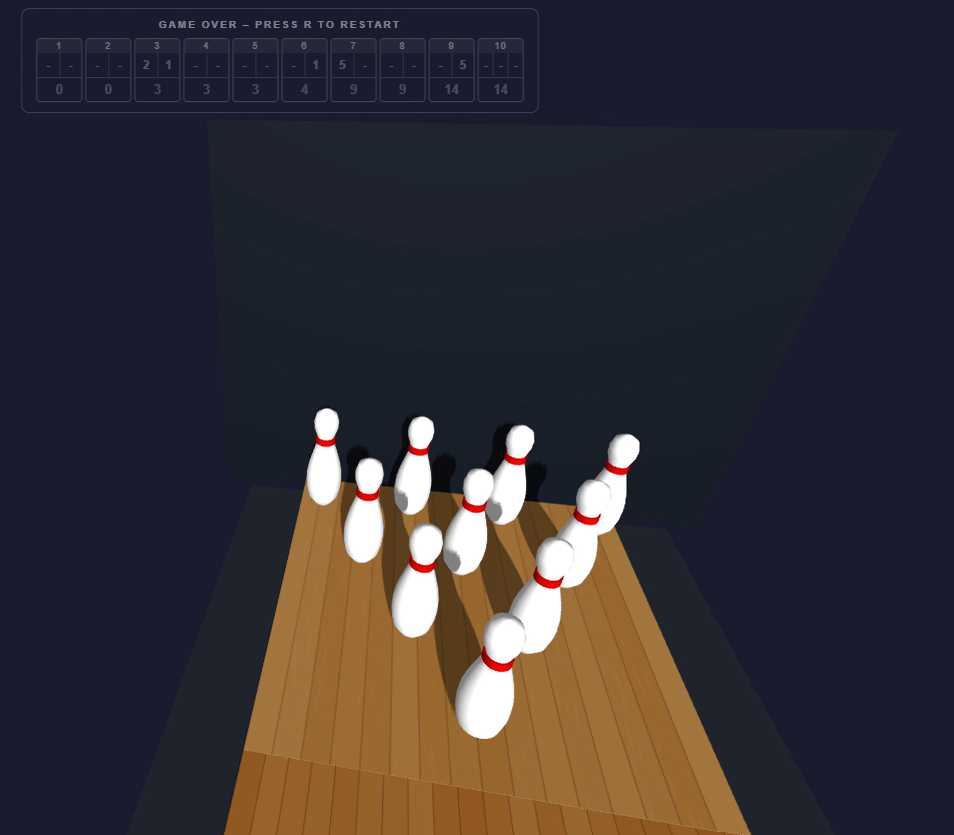
  <p><i>The fully resolved 10-frame scorecard at game end, with cumulative running totals filled in for every frame and the 'GAME OVER – Press R to Restart' banner replacing the scorecard title.</i></p>
</div>

## Gameplay Demo
